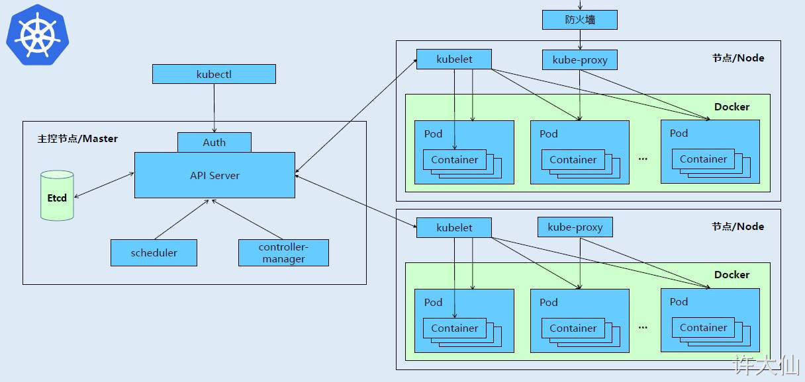
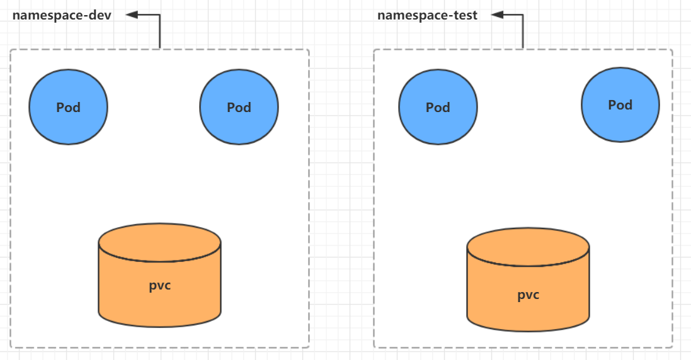

# Kubernetes

## 一、Kubernetes 概述和架构

### 1.简介

Kubernetes，首字母 K，尾字母 s，中间 8 个字母，简称 K8s。

### 2.功能

1. 自动装箱
   - 基于容器对应用运行环境的资源配置要求自动部署应用容器
2. 自我修复
   - 当容器失败时，会对容器进行重启
   - 当所部署的 Node 节点有问题时，会对容器进行重新部署和重新调度
   - 当容器未通过监控检查时，会关闭此容器直到容器正常运行时，才会对外提供服务
3. 水平扩展
   - 通过简单的命令、用户 UI 界面或基于 CPU 等资源使用情况，对应用容器进行规模扩大或规模剪裁
   - 当我们有大量的请求来临时，我们可以增加副本数量，从而达到水平扩展的效果
4. 服务发现
   - 用户不需使用额外的服务发现机制，就能够基于 Kubernetes 自身能力实现服务发现和负载均衡
5. 滚动更新
   - 可以根据应用的变化，对应用容器运行的应用，进行一次性或批量式更新
6. 版本回退
   - 可以根据应用部署情况，对应用容器运行的应用，进行历史版本即时回退
7. 密钥和配置管理
   - 在不需要重新构建镜像的情况下，可以部署和更新密钥和应用配置，类似热部署。
8. 存储编排
   - 自动实现存储系统挂载及应用，特别对有状态应用实现数据持久化非常重要
   - 存储系统可以来自于本地目录、网络存储 (NFS、Gluster、Ceph 等）、公共云存储服务
9. 批处理
   - 提供一次性任务，定时任务；满足批量数据处理和分析的场景

### 3.组件介绍

#### 3.1 组件介绍

- 一个 kubernetes 集群主要由控制节点（master）、工作节点（node）构成，每个节点上都会安装不同的组件。

- 控制节点（master）：集群的控制平面，负责集群的决策。

- - API Server：集群操作的唯一入口，接收用户输入的命令，提供认证、授权、API注册和发现等机制。

- - Scheduler：负责集群资源调度，按照预定的调度策略将 Pod 调度到相应的 node 节点上。

- - ControllerManager：负责维护集群的状态，比如程序部署安排、故障检测、自动扩展和滚动更新等。

- - Etcd：负责存储集群中各种资源对象的信息。

- 工作节点（node）：集群的数据平面，负责为容器提供运行环境。

- - Kubelet：负责维护容器的生命周期，即通过控制 Docker ，来创建、更新、销毁容器。

- - KubeProxy：负责提供集群内部的服务发现和负载均衡。

- - Docker：负责节点上容器的各种操作。



#### 3.2 组件调用关系的应用示例

部署一个 Nginx 服务来说明 Kubernetes 系统各个组件调用关系：

① 首先需要明确，一旦 Kubernetes 环境启动之后，master 和 node 都会将自身的信息存储到etcd数据库中。

② 一个Nginx服务的安装请求首先会被发送到 master 节点上的 API Server 组件。

③ API Server 组件会调用 Scheduler 组件来决定到底应该把这个服务安装到那个 node 节点上。此时，它会从 etcd 中读取各个 node 节点的信息，然后按照一定的算法进行选择，并将结果告知 API Server 。

④ API Server 调用 Controller-Manager 去调用 Node 节点安装 Nginx 服务。

⑤ Kubelet 接收到指令后，会通知 Docker ，然后由 Docker 来启动一个 Nginx 的 Pod 。Pod 是 Kubernetes 的最小操作单元，容器必须跑在 Pod 中。

⑥ 一个 Nginx 服务就运行了，如果需要访问 Nginx ，就需要通过 kube-proxy 来对 Pod 产生访问的代理，这样，外界用户就可以访问集群中的 Nginx 服务了。

### 4.概念

- Master：集群控制节点，每个集群要求至少有一个 Master 节点来负责集群的管控。
- Node：工作负载节点，由 Master 分配容器到这些 Node 工作节点上，然后 Node 节点上的 Docker 负责容器的运行。
- Pod：Kubernetes 的最小控制单元，容器都是运行在 Pod 中的，一个 Pod 中可以有一个或多个容器。
- Controller：控制器，通过它来实现对 Pod 的管理，比如启动 Pod 、停止 Pod 、伸缩 Pod 的数量等等。
- Service：Pod 对外服务的统一入口，其下面可以维护同一类的多个 Pod 。
- Label：标签，用于对 Pod 进行分类，同一类 Pod 会拥有相同的标签。
- NameSpace：命名空间，用来隔离 Pod 的运行环境。

## 二、kubernetes集群环境搭建


```bash
# 创建集群
[root@master ~]# kubeadm init \
	--apiserver-advertise-address=192.168.6.128 \
	--image-repository registry.aliyuncs.com/google_containers \
	--kubernetes-version=v1.17.4 \
	--service-cidr=10.96.0.0/12 \
	--pod-network-cidr=10.244.0.0/16
# 创建必要文件
[root@master ~]# mkdir -p $HOME/.kube
[root@master ~]# sudo cp -i /etc/kubernetes/admin.conf $HOME/.kube/config
[root@master ~]# sudo chown $(id -u):$(id -g) $HOME/.kube/config
```

## 三、资源管理

### 1.资源管理介绍

在kubernetes中，所有的内容都抽象为资源，用户需要通过操作资源来管理kubernetes。

> kubernetes的本质上就是一个集群系统，用户可以在集群中部署各种服务，所谓的部署服务，其实就是在kubernetes集群中运行一个个的容器，并将指定的程序跑在容器中。
>
> kubernetes的最小管理单元是pod而不是容器，所以只能将容器放在`Pod`中，而kubernetes一般也不会直接管理Pod，而是通过`Pod控制器`来管理Pod的。
>
> Pod可以提供服务之后，就要考虑如何访问Pod中服务，kubernetes提供了`Service`资源实现这个功能。
>
> 当然，如果Pod中程序的数据需要持久化，kubernetes还提供了各种`存储`系统。


学习kubernetes的核心，就是学习如何对集群上的`Pod、Pod控制器、Service、存储`等各种资源进行操作

### 2.YAML语言介绍

YAML是一个类似 XML、JSON 的标记性语言。它强调以**数据**为中心，并不是以标识语言为重点。因而YAML本身的定义比较简单，号称"一种人性化的数据格式语言"。

```xml
<people>
    <age>15</age>
    <address>Beijing</address>
</people>
```

```yaml
people:
  age: 15
  address: Beijing
```

YAML的语法比较简单，主要有下面几个：

- 大小写敏感
- 使用缩进表示层级关系
- 缩进不允许使用tab，只允许空格( 低版本限制 )
- 缩进的空格数不重要，只要相同层级的元素左对齐即可
- '#'表示注释

YAML支持以下几种数据类型：

- 纯量：单个的、不可再分的值
- 对象：键值对的集合，又称为映射（mapping）/ 哈希（hash） / 字典（dictionary）
- 数组：一组按次序排列的值，又称为序列（sequence） / 列表（list）

> 小提示：
>
> 1 书写yaml切记`:` 后面要加一个空格
>
> 2 如果需要将多段yaml配置放在一个文件中，中间要使用`---`分隔
>
> 3 下面是一个yaml转json的网站，可以通过它验证yaml是否书写正确
>
> [Json和YAML相互转换](https://www.json2yaml.com/convert-yaml-to-json)

### 3.资源管理方式

- 命令式对象管理：直接使用命令去操作kubernetes资源

  ```
  kubectl run nginx-pod --image=nginx:1.17.1 --port=80
  ```

- 命令式对象配置：通过命令配置和配置文件去操作kubernetes资源

  ```
  kubectl create/patch -f nginx-pod.yaml
  ```

- 声明式对象配置：通过apply命令和配置文件去操作kubernetes资源

  ```
  kubectl apply -f nginx-pod.yaml
  ```

| 类型           | 操作对象 | 适用环境 | 优点           | 缺点                             |
| -------------- | -------- | -------- | -------------- | -------------------------------- |
| 命令式对象管理 | 对象     | 测试     | 简单           | 只能操作活动对象，无法审计、跟踪 |
| 命令式对象配置 | 文件     | 开发     | 可以审计、跟踪 | 项目大时，配置文件多，操作麻烦   |
| 声明式对象配置 | 目录     | 开发     | 支持目录操作   | 意外情况下难以调试               |

#### 3.1命令式对象管理

**kubectl命令**

kubectl是kubernetes集群的命令行工具，通过它能够对集群本身进行管理，并能够在集群上进行容器化应用的安装部署。kubectl命令的语法如下：

```bash
kubectl [command] [type] [name] [flags]
#comand：指定要对资源执行的操作，例如create、get、delete
#type：指定资源类型，比如deployment、pod、service
#name：指定资源的名称，名称大小写敏感
#flags：指定额外的可选参数
```

```bash
# 查看所有pod
kubectl get pod 

# 查看某个pod
kubectl get pod pod_name

# 查看某个pod详细信息
kubectl get pod pod_name -o wide

# 查看某个pod,以yaml格式展示结果
kubectl get pod pod_name -o yaml
```

**资源类型**

kubernetes中所有的内容都抽象为资源，可以通过下面的命令进行查看:

```
kubectl api-resources
```

经常使用的资源有下面这些：

| 资源分类      | 资源名称                 | 缩写    | 资源作用        |
| ------------- | ------------------------ | ------- | --------------- |
| 集群级别资源  | nodes                    | no      | 集群组成部分    |
| namespaces    | ns                       | 隔离Pod |                 |
| pod资源       | pods                     | po      | 装载容器        |
| pod资源控制器 | replicationcontrollers   | rc      | 控制pod资源     |
|               | replicasets              | rs      | 控制pod资源     |
|               | deployments              | deploy  | 控制pod资源     |
|               | daemonsets               | ds      | 控制pod资源     |
|               | jobs                     |         | 控制pod资源     |
|               | cronjobs                 | cj      | 控制pod资源     |
|               | horizontalpodautoscalers | hpa     | 控制pod资源     |
|               | statefulsets             | sts     | 控制pod资源     |
| 服务发现资源  | services                 | svc     | 统一pod对外接口 |
|               | ingress                  | ing     | 统一pod对外接口 |
| 存储资源      | volumeattachments        |         | 存储            |
|               | persistentvolumes        | pv      | 存储            |
|               | persistentvolumeclaims   | pvc     | 存储            |
| 配置资源      | configmaps               | cm      | 配置            |
|               | secrets                  |         | 配置            |

**操作**

kubernetes允许对资源进行多种操作，可以通过--help查看详细的操作命令

```
kubectl --help
```

经常使用的操作有下面这些：

| 命令分类   | 命令         | 翻译                        | 命令作用                     |
| ---------- | ------------ | --------------------------- | ---------------------------- |
| 基本命令   | create       | 创建                        | 创建一个资源                 |
|            | edit         | 编辑                        | 编辑一个资源                 |
|            | get          | 获取                        | 获取一个资源                 |
|            | patch        | 更新                        | 更新一个资源                 |
|            | delete       | 删除                        | 删除一个资源                 |
|            | explain      | 解释                        | 展示资源文档                 |
| 运行和调试 | run          | 运行                        | 在集群中运行一个指定的镜像   |
|            | expose       | 暴露                        | 暴露资源为Service            |
|            | describe     | 描述                        | 显示资源内部信息             |
|            | logs         | 日志输出容器在 pod 中的日志 | 输出容器在 pod 中的日志      |
|            | attach       | 缠绕进入运行中的容器        | 进入运行中的容器             |
|            | exec         | 执行容器中的一个命令        | 执行容器中的一个命令         |
|            | cp           | 复制                        | 在Pod内外复制文件            |
|            | rollout      | 首次展示                    | 管理资源的发布               |
|            | scale        | 规模                        | 扩(缩)容Pod的数量            |
|            | autoscale    | 自动调整                    | 自动调整Pod的数量            |
| 高级命令   | apply        | rc                          | 通过文件对资源进行配置       |
|            | label        | 标签                        | 更新资源上的标签             |
| 其他命令   | cluster-info | 集群信息                    | 显示集群信息                 |
|            | version      | 版本                        | 显示当前Server和Client的版本 |

下面以一个namespace / pod的创建和删除简单演示下命令的使用：

```bash
# 创建一个namespace
[root@master ~]# kubectl create namespace dev
namespace/dev created
# 获取namespace
[root@master ~]# kubectl get ns
NAME              STATUS   AGE
default           Active   5h38m
dev               Active   9s
kube-flannel      Active   113m
kube-node-lease   Active   5h39m
kube-public       Active   5h39m
kube-system       Active   5h39m
# 在此namespace下创建并运行一个nginx的Pod
[root@master ~]# kubectl run pod --image=nginx:latest -n dev
kubectl run --generator=deployment/apps.v1 is DEPRECATED and will be removed in a future version. Use kubectl run --generator=run-pod/v1 or kubectl create instead.
deployment.apps/pod created
# 查看新创建的pod
[root@master ~]# kubectl get pods -n dev
NAME                   READY   STATUS              RESTARTS   AGE
pod-644584df94-whlqj   0/1     ContainerCreating   0          15s

[root@master ~]# kubectl describe pods pod-644584df94-whlqj -n dev
 ......
Events:
  Type    Reason     Age    From               Message
  ----    ------     ----   ----               -------
  Normal  Scheduled  6m31s  default-scheduler  Successfully assigned dev/pod-644584df94-whlqj to node1
  Normal  Pulling    6m29s  kubelet, node1     Pulling image "nginx:latest"
  Normal  Pulled     6m8s   kubelet, node1     Successfully pulled image "nginx:latest"
  Normal  Created    6m8s   kubelet, node1     Created container pod
  Normal  Started    6m8s   kubelet, node1     Started container pod
# 删除指定的pod
[root@master ~]# kubectl delete pods pod-644584df94-whlqj #需要指定名称空间
Error from server (NotFound): pods "pod-644584df94-whlqj" not found
[root@master ~]# kubectl delete pods pod-644584df94-whlqj -n dev
pod "pod-644584df94-whlqj" deleted

```

#### 3.2 命令式对象配置

命令式对象配置就是使用命令配合配置文件一起来操作kubernetes资源。

(1） 创建一个nginxpod.yaml，内容如下：

```yaml
apiVersion: v1
kind: Namespace
metadata:
  name: dev

---

apiVersion: v1
kind: Pod
metadata:
  name: nginxpod
  namespace: dev
spec:
  containers:
  - name: nginx-containers
    image: nginx:latest
```

(2)执行create命令，创建资源：

```bash
[root@master ~]# kubectl create -f nginxpod.yaml
namespace/dev created
pod/nginxpod created
```

(3)执行get命令，查看资源：

```bash
[root@master ~]# kubectl get ns dev
NAME   STATUS   AGE
dev    Active   4s
[root@master ~]# kubectl get pod -n dev
NAME       READY   STATUS    RESTARTS   AGE
nginxpod   1/1     Running   0          31s
```

(4)执行delete命令，删除资源：

```bash
[root@master ~]# kubectl delete -f nginxpod.yaml
namespace "dev" deleted
pod "nginxpod" deleted
```

> 总结:命令式对象配置的方式操作资源，可以简单的认为：命令  +  yaml配置文件（里面是命令需要的各种参数）

#### 3.3 声明式对象配置

声明式对象配置跟命令式对象配置很相似，但是它只有一个命令apply。

```bash
# 首先执行一次kubectl apply -f yaml文件，发现创建了资源
[root@master ~]# kubectl apply -f nginxpod.yaml
namespace/dev created
pod/nginxpod created
[root@master ~]# kubectl get ns dev
NAME   STATUS   AGE
dev    Active   48s
[root@master ~]# kubectl get pod -n dev
NAME       READY   STATUS    RESTARTS   AGE
nginxpod   1/1     Running   0          62s
# 再次执行一次kubectl apply -f yaml文件，发现说资源没有变动
[root@master ~]# kubectl apply -f nginxpod.yaml
namespace/dev unchanged
pod/nginxpod unchanged

```

```
总结:
    其实声明式对象配置就是使用apply描述一个资源最终的状态（在yaml中定义状态）
    使用apply操作资源：
        如果资源不存在，就创建，相当于 kubectl create
        如果资源已存在，就更新，相当于 kubectl patch
```

> 扩展：kubectl可以在node节点上运行吗 ?

kubectl的运行是需要进行配置的，它的配置文件是$HOME/.kube，如果想要在node节点运行此命令，需要将master上的.kube文件复制到node节点上，即在master节点上执行下面操作：

```bash
# scp  -r  HOME/.kube   node1: HOME/
scp  -r  ~/.kube   node1:~/ #当前节点复制到node1节点
```

> 使用推荐: 三种方式应该怎么用 ?

创建/更新资源 使用声明式对象配置 kubectl apply -f XXX.yaml

删除资源 使用命令式对象配置 kubectl delete -f XXX.yaml

查询资源 使用命令式对象管理 kubectl get(describe) 资源名称

## 四、实战入门

### 1.Namespace

Namespace是kubernetes系统中的一种非常重要资源，它的主要作用是用来实现**多套环境的资源隔离**或者**多租户的资源隔离**。

默认情况下，kubernetes集群中的所有的Pod都是可以相互访问的。但是在实际中，可能不想让两个Pod之间进行互相的访问，那此时就可以将两个Pod划分到不同的namespace下。kubernetes通过将集群内部的资源分配到不同的Namespace中，可以形成逻辑上的"组"，以方便不同的组的资源进行隔离使用和管理。

可以通过kubernetes的授权机制，将不同的namespace交给不同租户进行管理，这样就实现了多租户的资源隔离。此时还能结合kubernetes的资源配额机制，限定不同租户能占用的资源，例如CPU使用量、内存使用量等等，来实现租户可用资源的管理。



kubernetes在集群启动之后，会默认创建几个namespace

```bash
[root@master ~]# kubectl get namespace
NAME              STATUS   AGE
default           Active   23h  #  所有未指定Namespace的对象都会被分配在default命名空间
kube-flannel      Active   19h
kube-node-lease   Active   23h  #  集群节点之间的心跳维护，v1.13开始引入
kube-public       Active   23h  #  此命名空间下的资源可以被所有人访问（包括未认证用户）
kube-system       Active   23h  #  所有由Kubernetes系统创建的资源都处于这个命名空间

```

#### 1.1 查看

```bash
# 1 查看所有的ns  命令：kubectl get ns
[root@master ~]# kubectl get ns
NAME              STATUS   AGE
default           Active   45h
kube-node-lease   Active   45h
kube-public       Active   45h     
kube-system       Active   45h     

# 2 查看指定的ns   命令：kubectl get ns ns名称
[root@master ~]# kubectl get ns default
NAME      STATUS   AGE
default   Active   45h

# 3 指定输出格式  命令：kubectl get ns ns名称  -o 格式参数
# kubernetes支持的格式有很多，比较常见的是wide、json、yaml
[root@master ~]# kubectl get ns default -o yaml
apiVersion: v1
kind: Namespace
metadata:
  creationTimestamp: "2022-08-17T02:32:08Z"
  name: default
  resourceVersion: "151"
  selfLink: /api/v1/namespaces/default
  uid: e3e783a1-6355-4c69-a909-3aba0064dfa8
spec:
  finalizers:
  - kubernetes
status:
  phase: Active
# 4 查看ns详情  命令：kubectl describe ns ns名称
[root@master ~]# kubectl describe ns default
Name:         default
Labels:       <none>
Annotations:  <none>
Status:       Active  # Active 命名空间正在使用中  Terminating 正在删除命名空间

# ResourceQuota 针对namespace做的资源限制
# LimitRange针对namespace中的每个组件做的资源限制
No resource quota.
No LimitRange resource.
```

#### 1.2 **创建**

```bash
# 创建namespace
[root@master ~]# kubectl create ns dev
namespace/dev created
```

#### 1.3 **删除**

```bash
# 删除namespace
[root@master ~]# kubectl delete ns dev
namespace "dev" deleted
```

#### 1.4 **配置方式**

首先准备一个yaml文件：ns-dev.yaml

```yaml
apiVersion: v1
kind: Namespace
metadata:
  name: dev
```

然后就可以执行对应的创建和删除命令了：

创建：kubectl create -f ns-dev.yaml

删除：kubectl delete -f ns-dev.yaml

### 2.Pod

Pod是kubernetes集群进行管理的最小单元，程序要运行必须部署在容器中，而容器必须存在于Pod中。

Pod可以认为是容器的封装，一个Pod中可以存在一个或者多个容器。


kubernetes在集群启动之后，集群中的各个组件也都是以Pod方式运行的。可以通过下面命令查看：

```bash
[root@master ~]# kubectl get pod -n kube-system
NAME                             READY   STATUS    RESTARTS   AGE
coredns-9d85f5447-h7jsk          1/1     Running   1          25h
coredns-9d85f5447-rdvcz          1/1     Running   1          25h
etcd-master                      1/1     Running   1          25h
kube-apiserver-master            1/1     Running   1          25h
kube-controller-manager-master   1/1     Running   1          25h
kube-proxy-74ksx                 1/1     Running   1          25h
kube-proxy-d2ts7                 1/1     Running   1          25h
kube-proxy-sgjhp                 1/1     Running   1          25h
kube-scheduler-master            1/1     Running   1          25h
```

#### 2.1 创建并运行

kubernetes没有提供单独运行Pod的命令，都是通过Pod控制器来实现的

```bash
# 命令格式： kubectl run (pod控制器名称) [参数] 
# --image  指定Pod的镜像
# --port   指定端口
# --namespace  指定namespace
[root@master ~]# kubectl run nginx --image=nginx:latest --port=80 --namespace dev
kubectl run --generator=deployment/apps.v1 is DEPRECATED and will be removed in a future version. Use kubectl run --generator=run-pod/v1 or kubectl create instead.
deployment.apps/nginx created

```

#### 2.2 查看pod信息

```bash
# 查看Pod基本信息
[root@master ~]# kubectl get pods -n dev
NAME                    READY   STATUS    RESTARTS   AGE
nginx-dd6b5d745-vcjnk   1/1     Running   0          3m


# 查看Pod的详细信息
[root@master ~]# kubectl describe pod nginx -n dev
```


#### 2.3 访问Pod

```bash
# 获取podIP
[root@master ~]# kubectl get pods -n dev -o wide
NAME    READY   STATUS    RESTARTS   AGE    IP             NODE    ... 
nginx   1/1     Running   0          190s   10.244.1.23   node1   ...

#访问POD
[root@master ~]# curl http://10.244.1.23:80
<!DOCTYPE html>
<html>
<head>
	<title>Welcome to nginx!</title>
</head>
<body>
	<p><em>Thank you for using nginx.</em></p>
</body>
</html>
```


#### 2.4 删除指定Pod

```bash
# 删除指定Pod
[root@master ~]# kubectl delete pod nginx -n dev
pod "nginx" deleted

# 此时，显示删除Pod成功，但是再查询，发现又新产生了一个 
[root@master ~]# kubectl get pods -n dev
NAME                    READY   STATUS    RESTARTS   AGE
nginx-dd6b5d745-mrxpx   1/1     Running   0          24s

# 这是因为当前Pod是由Pod控制器创建的，控制器会监控Pod状况，一旦发现Pod死亡，会立即重建
# 此时要想删除Pod，必须删除Pod控制器

# 先来查询一下当前namespace下的Pod控制器
[root@master ~]# kubectl get deployment -n  dev
NAME    READY   UP-TO-DATE   AVAILABLE   AGE
nginx   1/1     1            1           25m

# 接下来，删除此Pod控制器
[root@master ~]# kubectl delete deploy nginx -n dev
deployment.apps "nginx" deleted

# 稍等片刻，再查询Pod，发现Pod被删除了
[root@master ~]# kubectl get pods -n dev
No resources found in dev namespace.
```


#### 2.5 配置操作

创建一个pod-nginx.yaml，内容如下：

```yaml
apiVersion: v1
kind: Pod
metadata:
  name: nginx
  namespace: dev
spec:
  containers:
  - image: nginx:latest
    name: pod
    ports:
    - name: nginx-port
      containerPort: 80
      protocol: TCP
```

然后就可以执行对应的创建和删除命令了：

创建：kubectl create -f pod-nginx.yaml

删除：kubectl delete -f pod-nginx.yaml

### 3.Label

Label是kubernetes系统中的一个重要概念。它的作用就是在资源上添加标识，用来对它们进行区分和选择。

Label的特点：

- 一个Label会以key/value键值对的形式附加到各种对象上，如Node、Pod、Service等等
- 一个资源对象可以定义任意数量的Label ，同一个Label也可以被添加到任意数量的资源对象上去
- Label通常在资源对象定义时确定，当然也可以在对象创建后动态添加或者删除

可以通过Label实现资源的多维度分组，以便灵活、方便地进行资源分配、调度、配置、部署等管理工作。

> 一些常用的Label 示例如下：
>
> - 版本标签："version":"release", "version":"stable"......
> - 环境标签："environment":"dev"，"environment":"test"，"environment":"pro"
> - 架构标签："tier":"frontend"，"tier":"backend"

标签定义完毕之后，还要考虑到标签的选择，这就要使用到Label Selector，即：

Label用于给某个资源对象定义标识

Label Selector用于查询和筛选拥有某些标签的资源对象

当前有两种Label Selector：

- 基于等式的Label Selector

  name = slave: 选择所有包含Label中key="name"且value="slave"的对象

  env != production: 选择所有包括Label中的key="env"且value不等于"production"的对象

- 基于集合的Label Selector

  name in (master, slave): 选择所有包含Label中的key="name"且value="master"或"slave"的对象

  name not in (frontend): 选择所有包含Label中的key="name"且value不等于"frontend"的对象

标签的选择条件可以使用多个，此时将多个Label Selector进行组合，使用逗号","进行分隔即可。例如：

> name=slave，env!=production
>
> name not in (frontend)，env!=production

#### 3.1 命令方式

```bash
# 创建pod
[root@master ~]# kubectl create -f pod-nginx.yaml
pod/nginx created
# 查看
[root@master ~]# kubectl get pods -n dev
NAME    READY   STATUS    RESTARTS   AGE
nginx   1/1     Running   0          23s
# 查看+标签
[root@master ~]# kubectl get pods -n dev --show-labels
NAME    READY   STATUS    RESTARTS   AGE   LABELS
nginx   1/1     Running   0          74s   <none>
# 为pod资源打标签
[root@master ~]# kubectl label pod nginx version=1.0 -n dev
pod/nginx labeled
# 再次查看
[root@master ~]# kubectl get pods -n dev --show-labels
NAME    READY   STATUS    RESTARTS   AGE     LABELS
nginx   1/1     Running   0          6m36s   version=1.0
# 再打一个
[root@master ~]# kubectl label pod nginx tier=back -n dev
pod/nginx labeled
# 再次查看
[root@master ~]# kubectl get pods -n dev --show-labels
NAME    READY   STATUS    RESTARTS   AGE     LABELS
nginx   1/1     Running   0          7m54s   tier=back,version=1.0
# 更新version标签出错
[root@master ~]# kubectl label pod nginx version=2.0 -n dev
error: 'version' already has a value (1.0), and --overwrite is false
# 更新标签
[root@master ~]# kubectl label pod nginx version=2.0 -n dev --overwrite
pod/nginx labeled
[root@master ~]# kubectl get pods -n dev --show-labels
NAME    READY   STATUS    RESTARTS   AGE   LABELS
nginx   1/1     Running   0          10m   tier=back,version=2.0
# 挑选标签
[root@master ~]# kubectl get pod -n dev -l version=2.0  --show-labels
NAME    READY   STATUS    RESTARTS   AGE   LABELS
nginx   1/1     Running   0          12m   tier=back,version=2.0
# 删除标签
[root@master ~]# kubectl label pod nginx tier- -n dev
pod/nginx labeled
[root@master ~]# kubectl get pods -n dev --show-labels
NAME    READY   STATUS    RESTARTS   AGE   LABELS
nginx   1/1     Running   0          14m   version=2.0

```

#### 3.2 配置方式

```
apiVersion: v1
kind: Pod
metadata:
  name: nginx
  namespace: dev
  labels:
    version: "3.0" 
    env: "test"
spec:
  containers:
  - image: nginx:latest
    name: pod
    ports:
    - name: nginx-port
      containerPort: 80
      protocol: TCP
```

然后就可以执行对应的更新命令了：kubectl apply -f pod-nginx.yaml

### 4.Deployment

在kubernetes中，Pod是最小的控制单元，但是kubernetes很少直接控制Pod，一般都是通过Pod控制器来完成的。Pod控制器用于pod的管理，确保pod资源符合预期的状态，当pod的资源出现故障时，会尝试进行重启或重建pod。

在kubernetes中Pod控制器的种类有很多，本章节只介绍一种：Deployment。


#### 4.1 命令操作

```bash
# 命令格式: kubectl create deployment 名称  [参数] 
# --image  指定pod的镜像
# --port   指定端口
# --replicas  指定创建pod数量
# --namespace  指定namespace
[root@master ~]# kubectl run nginx --image=nginx:latest --port=80 --replicas=3 -n dev
deployment.apps/nginx created

# 查看创建的Pod，deployment的信息
[root@master ~]# kubectl get deployment,pods -n dev
NAME                    READY   UP-TO-DATE   AVAILABLE   AGE
deployment.apps/nginx   2/3     3            2           40s

NAME                        READY   STATUS              RESTARTS   AGE
pod/nginx-dd6b5d745-7dl2b   1/1     Running             0          40s
pod/nginx-dd6b5d745-qs4tk   1/1     Running             0          40s
pod/nginx-dd6b5d745-r2rkk   0/1     ContainerCreating   0          40s

# UP-TO-DATE：成功升级的副本数量
# AVAILABLE：可用副本的数量
[root@master ~]# kubectl get deploy -n dev -o wide
NAME    READY   UP-TO-DATE   AVAILABLE   AGE   CONTAINERS   IMAGES         SELECTOR
nginx   3/3     3            3           18m   nginx        nginx:latest   run=nginx

# 查看deployment的详细信息
[root@master ~]# kubectl describe deploy nginx -n dev
Name:                   nginx
Namespace:              dev
CreationTimestamp:      Thu, 18 Aug 2022 15:13:15 +0800
Labels:                 run=nginx    # 标签
Annotations:            deployment.kubernetes.io/revision: 1
Selector:               run=nginx
Replicas:               3 desired | 3 updated | 3 total | 3 available | 0 unavailable
StrategyType:           RollingUpdate
MinReadySeconds:        0
RollingUpdateStrategy:  25% max unavailable, 25% max surge
Pod Template:
  Labels:  run=nginx
  Containers:
   nginx:
    Image:        nginx:latest
    Port:         80/TCP
    Host Port:    0/TCP
    Environment:  <none>
    Mounts:       <none>
  Volumes:        <none>
Conditions:
  Type           Status  Reason
  ----           ------  ------
  Available      True    MinimumReplicasAvailable
  Progressing    True    NewReplicaSetAvailable
OldReplicaSets:  <none>
NewReplicaSet:   nginx-dd6b5d745 (3/3 replicas created)
Events:
  Type    Reason             Age   From                   Message
  ----    ------             ----  ----                   -------
  Normal  ScalingReplicaSet  18m   deployment-controller  Scaled up replica set nginx-dd6b5d745 to 3
# 查看pod的label
[root@master ~]# kubectl get pods -n dev --show-labels
NAME                    READY   STATUS    RESTARTS   AGE   LABELS
nginx-dd6b5d745-7dl2b   1/1     Running   0          23m   pod-template-hash=dd6b5d745, run=nginx
nginx-dd6b5d745-qs4tk   1/1     Running   0          23m   pod-template-hash=dd6b5d745, run=nginx
nginx-dd6b5d745-r2rkk   1/1     Running   0          23m   pod-template-hash=dd6b5d745, run=nginx

  
# 删除 
[root@master ~]# kubectl delete deploy nginx -n dev
deployment.apps "nginx" deleted
[root@master ~]# kubectl get pods -n dev 
NAME                    READY   STATUS        RESTARTS   AGE  
nginx-dd6b5d745-qs4tk   0/1     Terminating   0          56m 
nginx-dd6b5d745-r2rkk   0/1     Terminating   0          56m 
[root@master ~]# kubectl get pods -n dev
No resources found in dev namespace.
[root@master ~]#

```

#### 4.2 配置操作

创建一个deploy-nginx.yaml，内容如下：

```yaml
apiVersion: apps/v1
kind: Deployment
metadata:
  name: nginx
  namespace: dev
spec:
  replicas: 3
  selector:
    matchLabels:
      run: nginx
  template:
    metadata:
      labels:
        run: nginx
    spec:
      containers:
      - image: nginx:latest
        name: nginx
        ports:
        - containerPort: 80
          protocol: TCP
```

通过标签将控制器和pod关联起来

然后就可以执行对应的创建和删除命令了：

创建：kubectl create -f deploy-nginx.yaml

删除：kubectl delete -f deploy-nginx.yaml

### 5.Service

通过上节课的学习，已经能够利用Deployment来创建一组Pod来提供具有高可用性的服务。

虽然每个Pod都会分配一个单独的Pod IP，然而却存在如下两问题：

- Pod IP 会随着Pod的重建产生变化
- Pod IP 仅仅是集群内可见的虚拟IP，外部无法访问

这样对于访问这个服务带来了难度。因此，kubernetes设计了Service来解决这个问题。

Service可以看作是一组同类Pod**对外的访问接口**。借助Service，应用可以方便地实现服务发现和负载均衡。


#### 5.1创建集群内部可访问的Service

```bash
# 暴露Service
[root@master ~]# kubectl expose deployment nginx --name=svc-nginx1 --type=ClusterIP --port=80 --target-port=80 -n dev
service/svc-nginx1 exposed

#service可以简写为svc， kubectl get svc -n dev
[root@master ~]# kubectl get service -n dev
NAME         TYPE        CLUSTER-IP       EXTERNAL-IP   PORT(S)   AGE
svc-nginx1   ClusterIP   10.108.187.102   <none>        80/TCP    37s

# 查看service
[root@master ~]# kubectl get svc svc-nginx1 -n dev -o wide
NAME         TYPE        CLUSTER-IP       EXTERNAL-IP   PORT(S)   AGE     SELECTOR
svc-nginx1   ClusterIP   10.108.187.102   <none>        80/TCP    3m51s   run=nginx

# 这里产生了一个CLUSTER-IP，这就是service的IP，在Service的生命周期中，这个地址是不会变动的
# 可以通过这个IP访问当前service对应的POD
[root@master ~]# curl 10.108.187.102:80
<!DOCTYPE html>
<html>
<head>
<title>Welcome to nginx!</title>
...
<p><em>Thank you for using nginx.</em></p>
</body>
</html>

```

#### 5.2 创建集群外部也可访问的Service

```bash
# 上面创建的Service的type类型为ClusterIP，这个ip地址只用集群内部可访问
# 如果需要创建外部也可以访问的Service，需要修改type为NodePort
[root@master ~]# kubectl expose deployment nginx --name=svc-nginx2 --type=NodePort --port=80 --target-port=80 -n dev
service/svc-nginx2 exposed

# 此时查看，会发现出现了NodePort类型的Service，而且有一对Port（80:32704/TCP）
[root@master ~]# kubectl get service -n dev
NAME         TYPE        CLUSTER-IP       EXTERNAL-IP   PORT(S)        AGE
svc-nginx1   ClusterIP   10.108.187.102   <none>        80/TCP         7m7s
svc-nginx2   NodePort    10.111.26.253    <none>        80:32704/TCP   28s


# 接下来就可以通过集群外的主机访问 节点IP:31928访问服务了
# 例如在的电脑主机上通过浏览器访问下面的地址
http://192.168.6.128:31928/
```

#### 5.3 删除Service

```bash
[root@master ~]# kubectl delete svc svc-nginx2  -n dev
service "svc-nginx2" deleted
[root@master ~]# kubectl get service -n dev
No resources found in dev namespace.
```

#### 5.4 配置方式

创建一个svc-nginx.yaml，内容如下：

```yaml
apiVersion: v1
kind: Service
metadata:
  name: svc-nginx
  namespace: dev
spec:
  clusterIP: 10.109.179.231 #固定svc的内网ip
  ports:
  - port: 80
    protocol: TCP
    targetPort: 80
  selector:
    run: nginx
  type: ClusterIP
```

然后就可以执行对应的创建和删除命令了：

创建：kubectl create -f svc-nginx.yaml

删除：kubectl delete -f svc-nginx.yaml

> **小结**
>
> 至此，已经掌握了Namespace、Pod、Deployment、Service资源的基本操作，有了这些操作，就可以在kubernetes集群中实现一个服务的简单部署和访问了，但是如果想要更好的使用kubernetes，就需要深入学习这几种资源的细节和原理。

## 五、Pod配置

## 六、Pod控制器详解

## 七、Service详解

## 八、数据存储

## 九、安全认证

## 十、DashBoard

